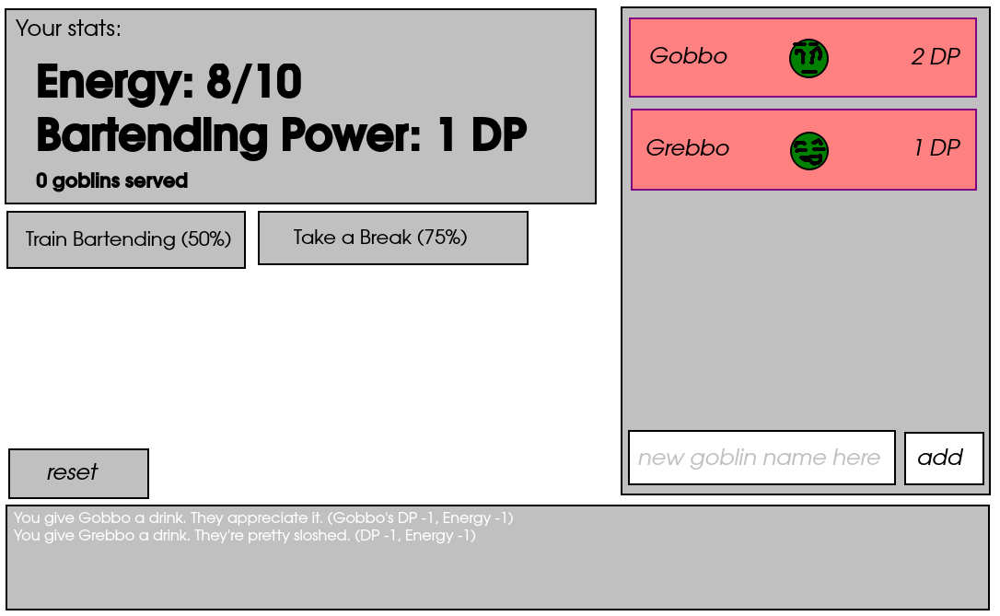

# Goblin Bartender

An endless game about serving rude goblins alcohol

## Wireframe

## HTML Elements
- Player character stats box
    - energy and bartending power stat displays
- Train Bartending button
- Take Break button
- Reset button
- Customer list box
    - dynamically created customers, each including:
        - name, emoji/image representing DP, DP display
    - at bottom, name entry and add button for adding goblin with custom name
        - if left blank, assign name
- Event log at bottom

## State
- Array of goblins (max of 4)
- Player Energy (max of 10)
- Player Bartending Power (max of 4)
- Array containing Event Log (max ten lines)
- Game Status (is player out of energy?)

## Events
- Click goblin:
    - reduce DP of goblin by Bartending Power stat
    - (goblin DP / 4) chance of player taking (goblin DP) Energy damage
    - display text explaining what happened in event log
    - additionally, if player brings goblin to 0 DP:
        - remove goblin from array
        - update event log
    - update Customer List

- Click Add Goblin Button:
    - Generate new goblin stats/name if none provided
    - add new goblin to goblin array
    - update Cutomer List

- Click Train Bartending button:
    - 25% chance (not 50%, despite what wireframe says) to increase DP by 1 to a max of 4
    - All goblins roll to decrease Energy

- Click Take a Break button:
    - 75% chance to heal 3 Energy
    - print result to event log
    - All goblins roll to decrease energy with halved DP
    - print results to event log

- Click Reset button:
    - set Energy to 10/10
    - set Bartending Power to 1 DP
    - clear goblin array, regenerate default goblins
    - clear event log
    - acknowledge reset in event log

## Functions
### Primary
- `serveGoblin(goblinInArray)`: "attack" specific goblin, decrease energy
- `addGoblin(name)`: add new goblin to array with randomized 1-4 DP, name specified, random name if `name` is blank
- `allGoblinsAttack(modifier)`: have all goblins roll to attack using `DP * modifier` value
- `trainBartending()`: roll to train bartending, call `allGoblinsAttack(1)`
- `takeBreak()`: roll to take break, call `allGoblinsAttack(0.5)`
- `resetGame()`: reset game, as per event above
- `addToLog(message)`: adds given string to event log array

### Render Functions
- `renderGoblin(goblin)`: returns goblin HTML element with name/stats of `goblin`
- `renderEventLogLine(line)`: returns HTML element with specific string `line` in it

### Display Functions
- `updateGoblinList()`: updates Customer List to reflect current state of goblin array
- `updateEventLog()`: updates Event Log to reflect current state of event log array

## Slices
1. Make page layout using HTML and CSS
2. Grab DOM elements, create state variables, create empty event handlers
3. write `renderGoblin(goblin)` and `renderEventLogLine()`, test
4. write `addToLog(message)`, test
5. write `updateGoblinList()` and `updateEventLog()`, test
6. write `serveGoblin(goblinInArray)`, `allGoblinsAttack(modifier)`, test
7. write rest of functions, test
